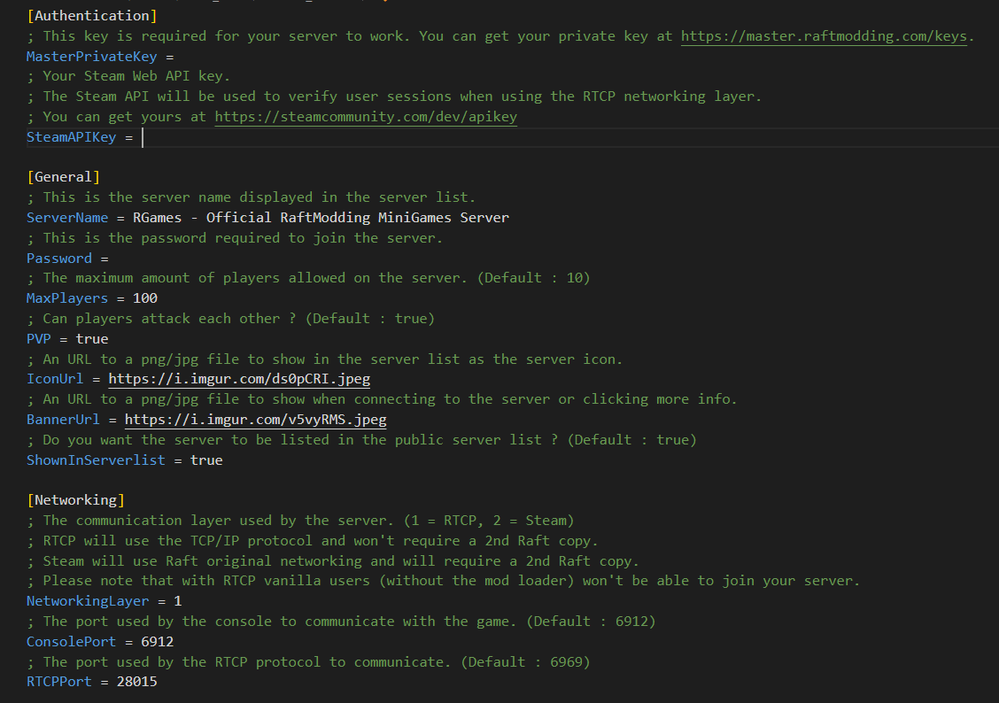
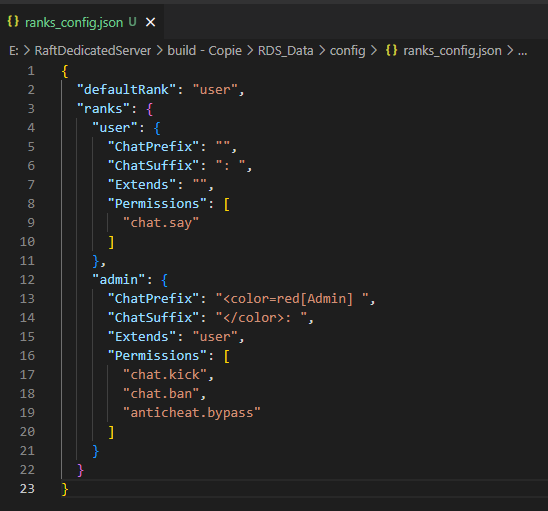

# Configuring your server

RDS currently has 2 config files : \
&#x20;\- `rds_config.ini`\
&#x20;\- `anticheat_config.ini`\
&#x20;\- `ranks_config.json`&#x20;

The `rds_config.ini` file contains the main server configuration such as your server name, the maximum players, if PVP is enabled and more.\
\
The `anticheat_config.ini` file contains the anticheat configuration, However we highly recommend you to keep it as it is by default or contact us if you have any problem.\
If you are experimented, you'll be able to change punishments, thresholds/tolerances & enable/disable modules.

### How to edit the .ini config files ?

The RDS configuration files are [INI files](https://en.wikipedia.org/wiki/INI\_file) they are really easy to edit and have comments & sections so that you can know what a config variable do and everything stays nice and organized.\
\
Below is an example `rds_config.ini` file.\
You can see that MaxPlayers has been set to 100, I've changed the server name and that i've configured an icon and a banner.\

### How to edit the .json config files ?

The ranks configuration file uses the JSON file format as it is way easier to add new ranks, configure permissions per ranks and chat prefixes/suffixes.

Below is an example `ranks_config.json` file.\
&#x20;\

