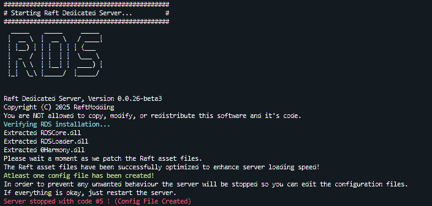
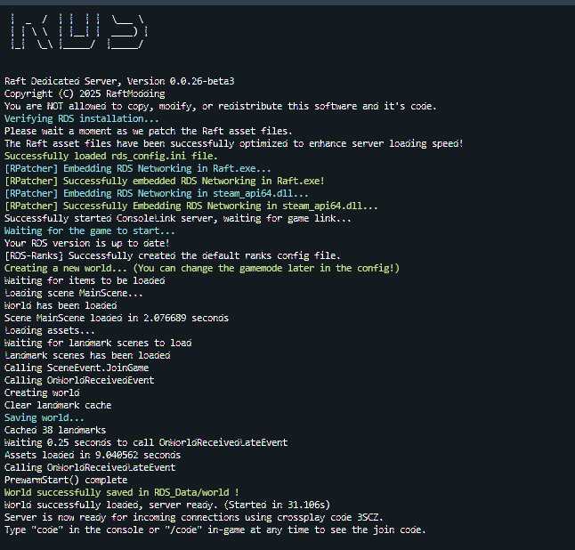

# Docker: Installing your Server


This currently only works if you use the beta version of Raft and the indev version of RDS. Once the beta version of Raft releases this will work you will be able to switch back to the Raft stable branch as well as the public RDS branch!&#x20;


## Requirements:

* An Installation of Docker
* Some knowledge on how to use Docker is recommended but not necessary to follow the guide

## Creating the container:

1. Pull the docker image using `docker pull ghcr.io/franzfischer78/raftmodding-rds:latest`
2. There are multiple ways you can now work with Files inside of docker. We recommend that you mount a local directory into the Docker Container to make things easier. Prepare a local directory where you will put all your RDS related files into. The RaftDedicatedServer.exe is the only file you need to add as the Game will be downloaded through steamcmd if necessary.  If you do not wish to use the automatic download you can place the game files manually into that directory.&#x20;

## Running the container

Run the container using the following command:



`docker run -v /path/to/local/dir:/home/container -e STEAM_USER="YourSteamUser" -e STEAM_PASS="YourSteamPassword" -e STARTUP="updateboth" ghcr.io/franzfischer78/raftmodding-rds:latest`



`docker run -v /path/to/local/dir:/home/container -e STARTUP="updateboth" ghcr.io/franzfischer78/raftmodding-rds:latest`



Set the startup environment variable to whatever fits your needs:\
\- normal : no updating\
\- updategame: update Raft\
\- updateserver: update RDS\
\- updateboth: update RDS and Raft


The STEAM\_USER and STEAM\_PASS variables are only used if you want the software to automatically update the game, therefore you do not need to set these if you don't need to update the game or if you wish to manage that yourself


If you start the Server now you should be greeted with the following:\

<figure><figcaption></figcaption></figure>

Head into your RDS folder and edit the following file with your preferred text editor for example nano or vim: `nano RDS_Data/config/rds_config.ini`\
Make sure to set the RDS Master Key. You can obtain it from our [master website](https://master.raftmodding.com/keys). Also make sure to set the UpdateBranch to indev.

Restart the Server and everything should be running!

<figure><figcaption></figcaption></figure>
