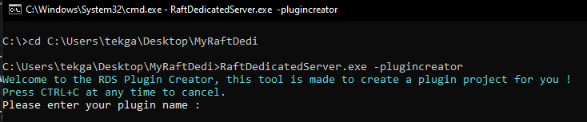
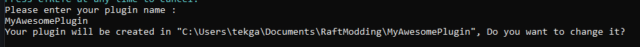

# How to create a plugin project

In order to make it easy for everyone to create plugins, we've created a plugin creator tool which will generate you a plugin project that is ready to start programming and already works.\
\
To use the Plugin Creator you have to use a console argument when starting **RaftDedicatedServer.exe** which is `-plugincreator`.\
\
The easiest way is to start CMD, navigate to your server folder and simply run the command `RaftDedicatedServer.exe -plugincreator` as shown below.

### How does it works ?

1 ) Simply enter your plugin name and press enter.\
For the example i'm gonna use the name `MyAwesomePlugin`.\
&#xNAN;_<mark style="color:green;">Once you entered your plugin name it should looks like this.</mark>_

2 ) Now that you entered your plugin name, the plugin creator is asking you if you want to change the project path, we highly recommend you to keep the default path and simply type `n` or `no` and press enter.\
\
And that's it ! Your plugin should be created !\\
