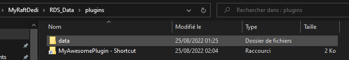

# How to load my plugin

If you just created your plugin project let's create a shortcut of your project folder in our plugins folder located in `RDS_Data/plugins` so we won't have to move files or build the plugin each time we modify something in the plugin. Yeah this is a great feature! 😁\
_<mark style="color:green;">Your plugin folder should looks something like this.</mark>_\
\
\
Now that your plugin is added as a shortcut in the plugins folder, RDS will automatically load it by default. We can check it by starting the server and verifying that there's no error and that the plugin default load text is shown as shown below.\
.PNG>)\
\
Now that your plugin is loaded there's some commands built in RDS that you can use : \
&#x20;\- `reloadplugin pluginName` Will reload the specified plugin and use the new version if you made changes.\
&#x20;\- `unloadplugin pluginName` Will simply unload the plugin.\
&#x20;\- `loadplugin pluginName` Will load the plugin if you unloaded it.\
&#x20;\- `reloadplugins` Will reload every plugins (Highly experimental and should not be used in production!)\
&#x20;\- `refreshplugins` Will refresh the plugin manager if you added a new plugin file or shortcut so you can then load it with the `loadplugin` command.

