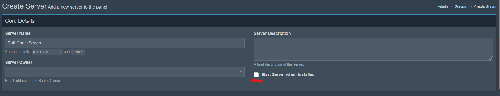

# Pterodactyl: Installing your Server


This currently only works if you use the beta version of Raft and the indev version of RDS. Once the beta version of Raft releases this will work you will be able to switch back to the Raft stable branch as well as the public RDS branch!&#x20;


## Requirements

* A working installation of Pterodactyl that has at least one node
* Some knowledge on how to use the Pterodactyl interface

## Getting the egg

1. First you need to download the egg from the [github repository](https://github.com/FranzFischer78/RDS-Beta-Docker-Image/blob/main/egg-raft-dedicated-server--r-d-s.json)
2. In your Pterodactyl admin panel go to Nests and create a new nest for Raft
3. Now you can import the egg you just download to the newly created Raft nest.
4. You can adjust the configuration of the egg in case you need to (this is only recommended for experienced users who want to fine tune the egg to their needs)

## Creating the Server

This step is very straightforward if you are already familiar with Pterodactyl

1. Go into Servers in your Pterodactyl admin panel and hit "create new"
2. A few Settings will be important here while you can configure others as you wish
   1.  Make sure to not Start the server when installed

       <figure><figcaption></figcaption></figure>

   2.  Make sure to give the Server at least 4gb of RAM and 12gb of Disk Space. Also 3-4 CPU cores should be given to the Server for a lag free experience\
       \

       <figure><figcaption></figcaption></figure>

   3.  Make sure the correct nest, egg and docker image are selected\

       <figure><figcaption></figcaption></figure>

   4.  You can fill out Server variables if you want but you will also be able to edit them later. An important variable is the startup one. This should only be set by the person managing the Panel. It will determine wether nothing gets updated, only the game gets updated, only RDS gets updated, or the Server and RDS get updated. \
       \

       <figure><figcaption></figcaption></figure>

       Set this to:\
       \- normal : no updating\
       \- updategame: update Raft\
       \- updateserver: update RDS\
       \- updateboth: update RDS and Raft
   5. You can now create the Server
3. Now open your newly created Server panel. You first need to go to the files tab and upload the RaftDedicatedServer.exe . You can download it on our master website available [here](https://master.raftmodding.com/).
4. Next go to the startup tab. Every setting here is optional and you can configure these as you wish but you must set the RDS Master Key. You can obtain it from our [master website](https://master.raftmodding.com/keys). Also if you want the game to update/download automatically (if updategame is set) then you need to specify a steam username and password. Make also sure that the Update Branch is set to indev!
5. The Server is now ready to start. The first startup will download the game (if specified). Make sure to allow the steam login/enter the auth code if you have 2 factor authentication enabled.&#x20;
6.  The Server should now have started and you will see that RDS has successfully initialized and prompts a restart. If pterodactyl did not automatically restart the server you can now do so. \

    <figure><figcaption></figcaption></figure>

7.  The Server now restarts and should be accessible through the Server list (if enabled) or the world code\

    <figure><figcaption></figcaption></figure>
