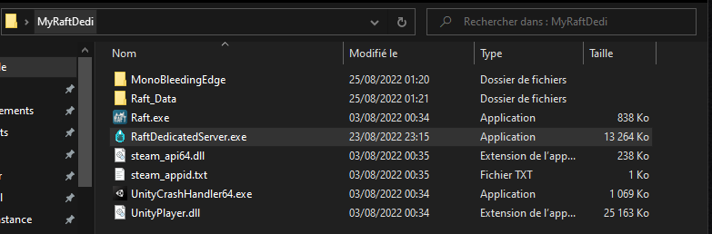
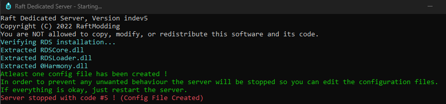
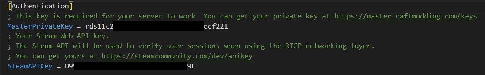

# Windows: Installing your server

<figure><figcaption></figcaption></figure>

RDS is really easy to install as it is a single application named **RaftDedicatedServer.exe** that you can download on our master website available [here](https://master.raftmodding.com/).

### How to install ?

1 ) Download Raft from Steam and copy all the Raft files in a folder.\
\
2 ) Put the downloaded **RaftDedicatedServer.exe** in the same folder and launch it.\
_<mark style="color:green;">Your folder should looks like the following image.</mark>_\
\
On the first start, RDS will generate all the required directories, required files and the configuration files as shown below.\
\
\
3 ) Now go in `YourFolder/RDS_Data/config` and open the file `rds_config.ini` with your favorite text editor (We recommend [Notepad++](https://notepad-plus-plus.org/downloads/) or [VSCode](https://code.visualstudio.com/)).\
\
4 ) In order to successfully start and secure your server you need an RDS Private Key obtainable [here](https://master.raftmodding.com/keys) and a Steam API Key obtainable [here](https://steamcommunity.com/dev/apikey). After getting both keys, add them in the configuration after the `=` symbol. (If you don't know how .ini config files works, visit our configuration guide available [here](configuring-your-server.md)).\
_<mark style="color:green;">Your configuration file should then be similar to this except it'll have your own private keys.</mark>_\
\
5 ) Finally, start the **RaftDedicatedServer.exe** again and you should be good to go !
